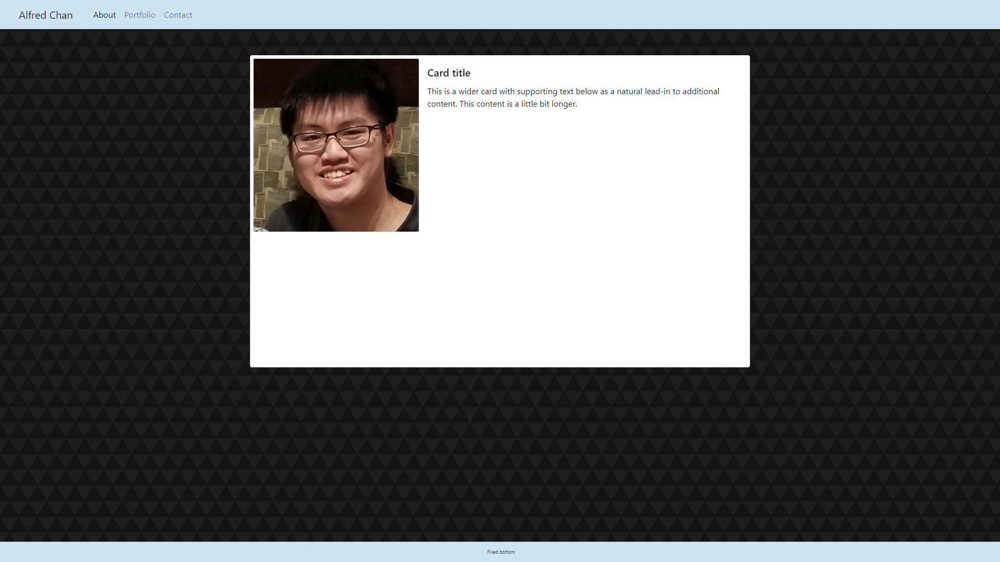
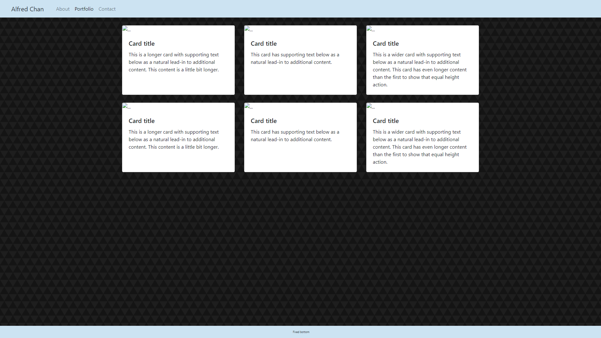
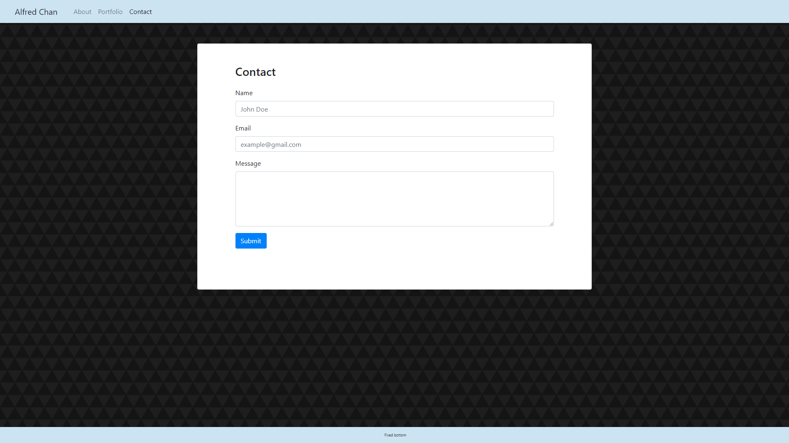

# Bootstrap-Portfolio

This is a design of a portfolio using Bootstrap elements to design the page. The basic layout of the portfolio is based on [a prior assignment](https://github.com/b0bland/Basic-Portfolio), with the layout converted into a design using Bootstrap. 

## Technologies Used

* HTML
* CSS

## Authors

* Alfred Chan
